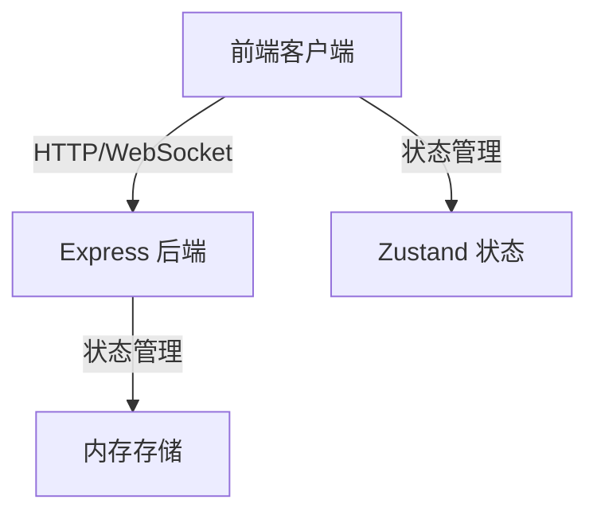
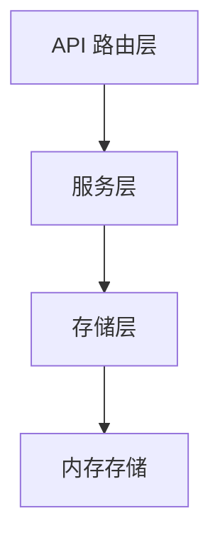
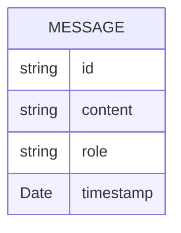

## 1. Architecture Design



## 2. Technology Description
- **Frontend**: React@18 + TypeScript + Tailwind CSS@3 + Vite + Zustand
- **Initialization Tool**: vite-init
- **Backend**: Express@4 + TypeScript
- **实时通信**: Server-Sent Events (SSE) 或 WebSocket
- **图标**: lucide-react

## 3. Route Definitions
| Route | Purpose |
|-------|---------|
| / | 对话页面 (默认) |
| /settings | 设置页面 |

## 4. API Definitions (if backend exists)

### Type Definitions
```typescript
interface Message {
  id: string;
  content: string;
  role: 'user' | 'assistant';
  timestamp: Date;
}

interface ChatRequest {
  message: string;
}

interface ChatResponse {
  success: boolean;
  message?: Message;
}
```

### API Endpoints
- `POST /api/chat` - 发送聊天消息
- `GET /api/chat/history` - 获取聊天历史
- `GET /api/chat/stream` - 实时聊天流 (SSE)

## 5. Server Architecture Diagram (if backend exists)



## 6. Data Model (if applicable)

### 6.1 Data Model Definition



### 6.2 Data Definition Language
本项目使用内存存储，无需数据库。
