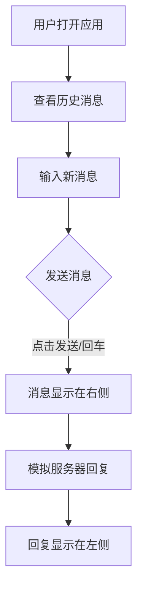

## 1. Product Overview
一个现代化的实时对话应用，演示如何构建具有实时通信功能的全栈 Web 应用。该应用支持多设备访问，包括桌面端和移动端，适合学习和扩展。

## 2. Core Features

### 2.1 User Roles (if applicable)
| Role | Registration Method | Core Permissions |
|------|---------------------|------------------|
| Normal User |无需注册 | 使用所有对话功能 |

### 2.2 Feature Module
1. **对话页面**: 实时聊天界面，消息列表，输入框，发送按钮
2. **设置页面**: 简单的用户偏好设置

### 2.3 Page Details
| Page Name | Module Name | Feature description |
|-----------|-------------|---------------------|
| 对话页面 | 消息列表 | 显示历史消息，支持滚动查看 |
| 对话页面 | 消息输入 | 支持文本输入，回车发送 |
| 对话页面 | 实时同步 | 模拟实时消息接收 |
| 设置页面 | 用户偏好 | 简单的主题设置 |

## 3. Core Process
用户打开应用 → 在输入框输入消息 → 点击发送或按回车 → 消息添加到聊天窗口 → 模拟服务器实时回复

## 4. User Interface Design
### 4.1 Design Style
- **Primary color**: 蓝色系 (#3b82f6, #1d4ed8)
- **Secondary color**: 紫色 (#8b5cf6)
- **Button style**: 圆角矩形，具有悬停效果
- **Font**: 使用现代无衬线字体 (Inter 或 Noto Sans)
- **Layout style**: 聊天窗口居中，左侧导航，移动端适配
- **Icon style**: 使用 Lucide 图标库

### 4.2 Page Design Overview
| Page Name | Module Name | UI Elements |
|-----------|-------------|-------------|
| 对话页面 | 聊天窗口 | 深色/浅色主题，消息气泡，时间戳 |
| 对话页面 | 输入区域 | 圆角输入框，发送按钮，表情支持 |
| 设置页面 | 主题切换 | 滑动开关，卡片式布局 |

### 4.3 Responsiveness
移动优先设计，完美适配手机端、平板和桌面端，触摸交互优化。
